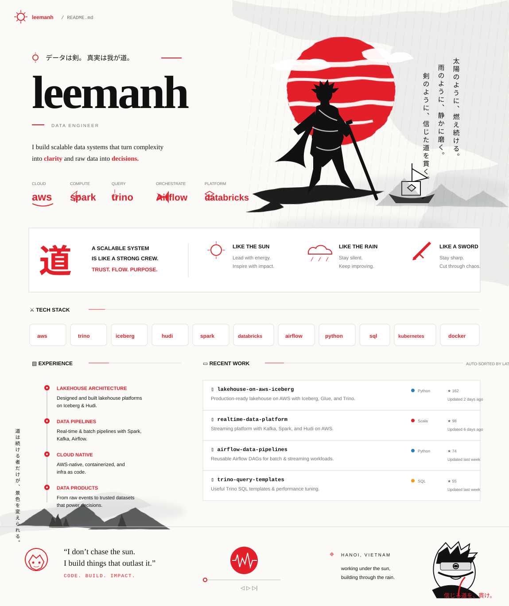

  
   
  
  &nbsp;
  <a href="https://github.com/lhem43?tab=repositories">Repositories</a>
  &nbsp;•&nbsp;
  <a href="https://github.com/lhem43/lhem43/blob/main/assets/profile/profile-code.svg">Profile source</a>

<b>⚔ Open profile controls</b>

 

- [Browse public repositories](https://github.com/lhem43?tab=repositories)
- [Open the latest public commit](https://github.com/lhem43/kufi-e-wallet-with-hyperledger-chain-cli/commit/bdfea1c199b93b92500c69115a281132d19dc0b4)
- [Inspect the code-generated SVG](https://github.com/lhem43/lhem43/blob/main/assets/profile/profile-code.svg)
- [View profile automation runs](https://github.com/lhem43/lhem43/actions/workflows/update-profile.yml)

<!-- recent-projects:start -->
<h3>⚡ Recent public work</h3>
<table>
<thead><tr><th>Repository</th><th>Language</th><th>Stars</th><th>Latest commit</th><th>Updated</th></tr></thead>
<tbody>
<tr><td><a href="https://github.com/lhem43/kufi-e-wallet-with-hyperledger-chain-cli"><b>kufi-e-wallet-with-hyperledger-chain-cli</b></a> Public repository</td><td><code>Dart</code></td><td>★ 0</td><td><a href="https://github.com/lhem43/kufi-e-wallet-with-hyperledger-chain-cli/commit/bdfea1c199b93b92500c69115a281132d19dc0b4"><code>bdfea1c</code></a> docs: polish project README and architecture overview</td><td>15 Aug 2026</td></tr>
</tbody>
</table>
Auto-generated from public repositories by GitHub Actions.
<!-- recent-projects:end -->
