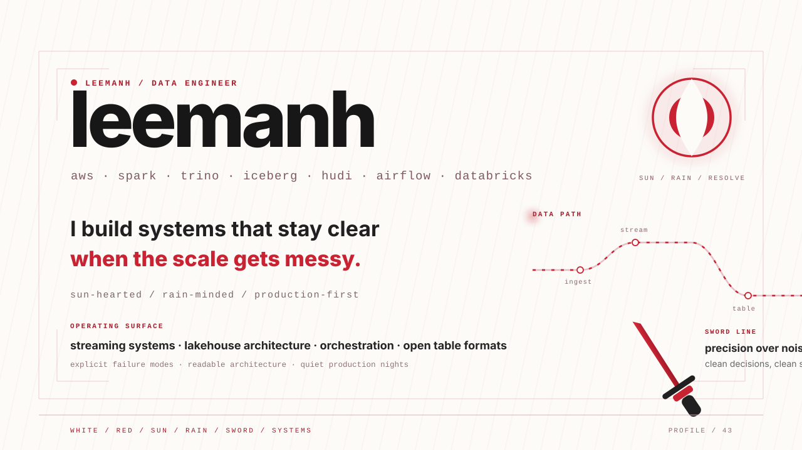
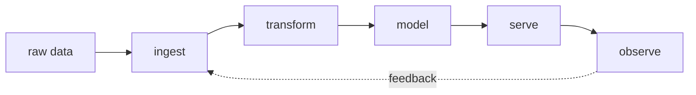

<div align="center">



<br/>


</div>

---

## `01 // whoami`

```text
$ whoami

leemanh
data engineer

I build systems that turn messy, fragmented data
into reliable and useful data products.

main/
├── data engineering
├── data pipelines
├── data modeling
├── databases
└── infrastructure

side_quests/
├── distributed systems
├── backend engineering
├── AI
└── blockchain
```

> I care less about moving data from A to B. I care about making sure it still works when B changes at 2:47 AM.

---

## `02 // data flow`



```text
           DATA PLATFORM / HEALTH

ingestion        ███████████████████░   running
transformation   ████████████████████   healthy
quality          ██████████████████░░   watching
observability    ███████████████████░   online
curiosity        ████████████████████   no limit
```

---

## `03 // telemetry`

<div align="center">

### `LEEMANH / LIVE SIGNAL`


</div>

```text
PROFILE HITS      live
CONTRIBUTIONS     live
ACTIVITY          live
CURRENT MODE      building
SYSTEM STATE      operational
```

---

## `04 // toolbox`

```text
languages/
├── python
└── sql

data/
├── relational databases
├── data modeling
├── etl / elt
└── data processing

systems/
├── docker
├── linux
└── automation

engineering/
├── git
├── github
└── backend systems
```

> Tools change. Fundamentals scale.

---

## `05 // featured build`

### `KUFI`

**consortium e-wallet + distributed infrastructure**

```text
CAPSTONE PROJECT

flutter
   │
api gateway
   │
microservices
   │
risk processing
   │
hyperledger fabric
   │
monitoring + evaluation
```

A capstone project exploring permissioned blockchain infrastructure, distributed backend services, monitoring, and financial-system architecture.

**→ [explore kufi](https://github.com/lhem43/kufi-e-wallet-with-hyperledger-chain-cli)**

```text
classification:
  distributed systems / blockchain / backend

primary career:
  data engineering
```

---

## `06 // side quests`

```text
distributed systems      ███████████████░░
backend engineering      ████████████████░
AI                       ███████████░░░░░░
blockchain               ████████████░░░░░

breaking docker          █████████████████
fixing docker            █████████████████
```

---

## `07 // query`

```sql
SELECT
    reliability,
    scalability,
    curiosity
FROM leemanh
WHERE status = 'building';
```

```text
+-------------+-------------+-----------+
| reliability | scalability | curiosity |
+-------------+-------------+-----------+
|     true    |    true     | unlimited |
+-------------+-------------+-----------+

3 fields returned.
```

---

## `08 // operating principles`

```text
01  automate the boring parts
02  make failures observable
03  data quality > pretty dashboards
04  simple systems first
05  understand the system below the abstraction
06  leave things easier to operate than you found them
```

---

<div align="center">

```text
────────────────────────────────────────────

              END OF STREAM

                 leemanh

          data in. signal out.

────────────────────────────────────────────
```

`● ONLINE` &nbsp;&nbsp; `PROFILE HITS: LIVE` &nbsp;&nbsp; `STATUS: BUILDING`

</div>
