  

 

<table>
<tr>
<td width="58%" valign="top">

### current arc

I’m **leemanh** — a data engineer working around **streaming systems, lakehouse architecture, and data platforms**.

I care about systems that stay readable when they get bigger: clear data movement, reliable orchestration, and storage/query layers that remain easy to reason about after the first successful demo.

My default question is not just *“can this scale?”* but *“can a team still understand it when the pressure goes up?”*

</td>
<td width="42%" valign="top">

### operating surface

`aws` · `spark` · `trino` · `iceberg`  
`hudi` · `airflow` · `databricks`  
`kafka` · `dbt` · `python`

### what I optimize for

- clarity under scale
- boring production
- clean interfaces
- fast debugging
- explicit failure modes

</td>
</tr>
</table>

<b>open profile DNA</b>

 

| motif | what it means here |
|---|---|
| sun | ambition, visibility, lead energy |
| rain | calm, patience, reflective thinking |
| sword line | precision, decisive execution, clean cuts |
| white / red | clarity first, intensity only where it matters |

## recent work

<!-- recent-projects:start -->
**[kufi-e-wallet-with-hyperledger-chain-cli](https://github.com/lhem43/kufi-e-wallet-with-hyperledger-chain-cli)**  
[15 Aug 2026](https://github.com/lhem43/kufi-e-wallet-with-hyperledger-chain-cli/commit/bdfea1c199b93b92500c69115a281132d19dc0b4) · docs: polish project README and architecture overview
<!-- recent-projects:end -->

auto-sorted by latest public commit

 

Prefer sharp architecture, quiet systems, and production that stays boring.
