  

  

    
    
    
    
  

  データは剣。真実は我が道。 · data is the blade, truth is the path.

---

### ⚔ TECH STACK

  
  
  
  
  
  
  
  
  
  

<table>
<tr>
<td width="50%" valign="top">

### 道 · EXPERIENCE

<b>Lakehouse architecture</b>

 
Designed and built data platforms around Iceberg / Hudi, cloud object storage, query engines, and reliable metadata layers.

<b>Data pipelines</b>

 
Batch and streaming pipelines, orchestration, ingestion, transformation, and production observability.

<b>Cloud native</b>

 
Containerized workloads, AWS-native services, infrastructure-aware engineering, Kubernetes, and Docker.

<b>Data products</b>

 
Turning raw events into trusted, queryable datasets that can support product and engineering decisions.

</td>
<td width="50%" valign="top">

### ☀ PRINCIPLES

> **LIKE THE SUN**  
> Lead with energy. Inspire with impact.

> **LIKE THE RAIN**  
> Stay quiet. Keep improving.

> **LIKE A SWORD**  
> Stay sharp. Cut through chaos.

 

<a href="https://github.com/lhem43?tab=repositories"><b>→ Open all repositories</b></a> 
<a href="https://github.com/lhem43/lhem43/actions/workflows/update-profile.yml"><b>→ Inspect profile automation</b></a> 
<a href="https://github.com/lhem43/lhem43/blob/main/assets/profile/profile-code.svg"><b>→ Inspect SVG source</b></a>

</td>
</tr>
</table>

---

<!-- recent-projects:start -->
<h3>⚡ Recent public work</h3>
<table>
<thead><tr><th>Repository</th><th>Language</th><th>Stars</th><th>Latest commit</th><th>Updated</th></tr></thead>
<tbody>
<tr><td><a href="https://github.com/lhem43/kufi-e-wallet-with-hyperledger-chain-cli"><b>kufi-e-wallet-with-hyperledger-chain-cli</b></a> Public repository</td><td><code>Dart</code></td><td>★ 0</td><td><a href="https://github.com/lhem43/kufi-e-wallet-with-hyperledger-chain-cli/commit/bdfea1c199b93b92500c69115a281132d19dc0b4"><code>bdfea1c</code></a> docs: polish project README and architecture overview</td><td>15 Aug 2026</td></tr>
</tbody>
</table>
Auto-generated from public repositories by GitHub Actions.
<!-- recent-projects:end -->

---

  <i>“I don't chase the sun. I build things that outlast it.”</i> 
  CODE. BUILD. IMPACT. · HANOI, VIETNAM

