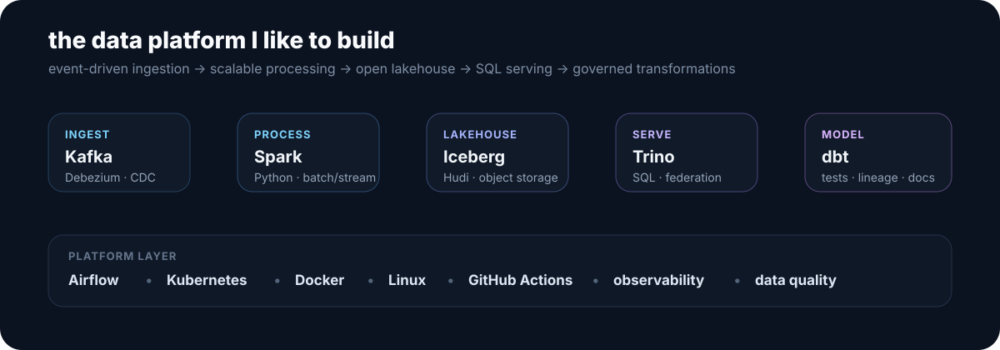

 

## about

I’m **leemanh**, a Data Engineer focused on building data platforms that are reliable, scalable, and easy to operate.

My work is mostly around **batch + streaming pipelines, CDC, lakehouse architectures, orchestration, distributed compute, and analytics engineering**. I like systems where the pieces fit together cleanly — not just pipelines that happen to run.

---

## data engineering stack

`Python` · `SQL` · `Spark` · `Airflow` · `dbt` · `Kafka` · `Debezium` · `Trino` · `Iceberg` · `Hudi` · `Kubernetes` · `Docker`

---

## what I care about

- **Reliable pipelines** — retries, idempotency, backfills, schema evolution, and sensible failure handling.
- **Streaming & CDC** — moving operational data into analytical systems with low friction.
- **Lakehouse design** — open table formats, scalable compute, and decoupled storage/processing.
- **Data modeling** — datasets that are understandable and useful, not just technically correct.
- **Platform engineering** — orchestration, deployment, observability, and keeping systems maintainable.

---

## github activity

---

## featured project

### [Kufi — Consortium E-Wallet & Blockchain Platform](https://github.com/lhem43/kufi-e-wallet-with-hyperledger-chain-cli)

A capstone project where I explored distributed systems beyond my main Data Engineering track: Hyperledger Fabric, microservices, monitoring, risk services, and a Flutter client.

**Why it matters:** it reflects how I approach engineering systems end-to-end — infrastructure, backend services, observability, and operational concerns — even when the domain is outside data engineering.

---

## side interests

`distributed systems` · `backend engineering` · `AI systems` · `robotics` · `blockchain`

---

### build boring pipelines. make the data interesting.

leemanh · data engineer

